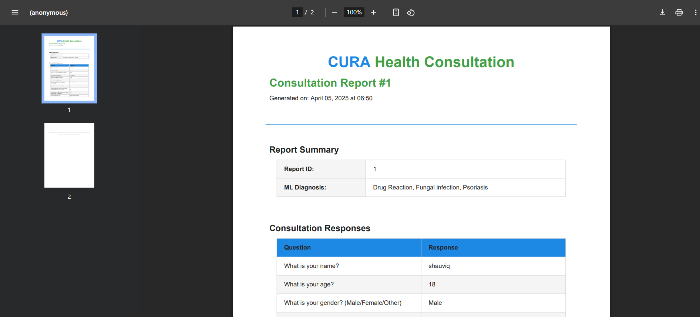

# 🧠 CURA - AI-Powered Health Assistant

CURA is a smart, AI-driven web platform that connects patients and doctors through seamless communication and instant preliminary health consultations. It integrates an ML model to analyze symptoms and generate helpful insights, which are then packaged into a well-structured PDF report for doctors. Appointments are managed with distinct dashboards for both patients and healthcare professionals.

---

## 🚀 Features

- 🔍 **AI Health Consultation**  
  Patients describe their symptoms, and an AI model provides intelligent predictions and suggestions.

- 🧾 **Automated PDF Report**  
  All patient responses and AI-generated outputs are compiled into a clean PDF sent to the doctor before the appointment.

- 👨‍⚕️ **Dual Dashboard Access**  
  - **Patients:** Request appointments and view reports.  
  - **Doctors:** View upcoming appointments and access patient-submitted forms + PDFs.

- 🗂️ **Backend Data Handling**  
  Django backend receives form data, processes it, and generates PDFs.

- 🧠 **Integrated Machine Learning Model**  
  Built-in multi-layered ML model powered by PyTorch (3-layer decision system).

---

## 🛠️ Tech Stack

| Layer        | Technology       |
|--------------|------------------|
| Frontend     | React.js,  CSS |
| Backend      | Django, Django REST Framework |
| ML Model     | Python, Torch     |
| PDF Generation | ReportLab       |
| Database     | SQLite / PostgreSQL |

---

## 🧾 Sample Generated PDF




---

## 📸 Screenshots

### 🧠 AI Consultation Page


### 👤 Home Page


---

## 📁 Project Structure

```
CURA/
├── backend/
│   ├── api/
│   │   ├── views.py
│   │   ├── urls.py
│   │   └── models.py
│   ├── MLModel/
│   │   ├── layer1.py
│   │   ├── layer2.py
│   │   └── layer3.py
│   ├── utils/
│   │   └── pdf_generator.py
│   └── manage.py
├── frontend/
│   └── cura-app/
│       ├── src/
│       │   ├── components/
│       │   ├── pages/
│       │   ├── App.jsx
│       │   └── main.jsx
│       └── package.json
└── README.md
```

---

## 💻 How to Run Locally

### 1️⃣ Clone the Repository

```bash
git clone https://github.com/shauviq/CURA.git
cd CURA
```

### 2️⃣ Backend Setup (Django)

```bash
cd backend
python -m venv venv
venv\Scripts\activate   # or source venv/bin/activate on Mac/Linux
pip install -r requirements.txt
python manage.py makemigrations
python manage.py migrate
python manage.py runserver
```

> Make sure to have the necessary models and torch installed:  
> `pip install torch reportlab django djangorestframework`

### 3️⃣ Frontend Setup (React)

```bash
cd frontend/cura-app
npm install
npm run dev
```

---

## 👨‍💻 Contributors

| Name           | Role        | LinkedIn                                                                                       |
|----------------|-------------|------------------------------------------------------------------------------------------------|
| Shauviq Mishra | Frontend    | [linkedin.com/in/shauviqmishra](https://www.linkedin.com/in/shauviqmishra/)                   |
| Aanan          | ML Engineer | [linkedin.com/in/aananchopra](https://www.linkedin.com/in/aananchopra)                        |
| Samar Verma    | Deployment  | [linkedin.com/in/samar-verma-f16sam](https://www.linkedin.com/in/samar-verma-f16sam/?originalSubdomain=in) |
| Manas Basra    | Backend     | [linkedin.com/in/manasveer-singh-basra-172524316](https://www.linkedin.com/in/manasveer-singh-basra-172524316/) |

---

## 🙌 Acknowledgements

Special thanks to our mentors and teammates who helped bring CURA to life.
